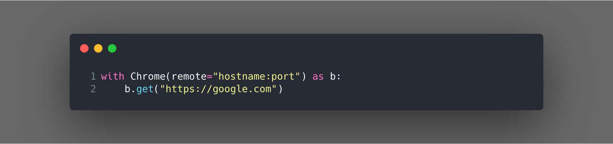

<h1 align="center">
    Wire
</h1>

<p align="center">
    
    <a href="https://github.com/ambv/black">
        
    </a>
    
    
    <a href="https://codecov.io/gh/MisterBianco/Wire">
        
    </a>
    <a href="https://www.codefactor.io/repository/github/misterbianco/wire">
        
    </a>
</p>

Wire is a python wrapper around selenium to make writing web tests easier and safer.

This framework is built for python 3.7+

---

### Installation

Environment with python3.7 and [Poetry](https://github.com/sdispater/poetry)

```bash
$ curl -sSL https://raw.githubusercontent.com/sdispater/poetry/master/get-poetry.py | python3
$ poetry install
$ poetry run pytest tests/
```

---

# Run locally

Simple just define a browser instance

```python3
with Chrome() as b:
    b.get("https://google.com")
```

# Run remote

Also simple :snake:



### Install Drivers

#### Chrome Driver

MAC

```bash
$ brew tap homebrew/cask && brew cask install chromedriver
```

LINUX

```bash
$ sudo ./install_chromedriver.sh
```

#### Firefox Driver

MAC

```bash
$ brew install geckodriver
```

LINUX

```bash
$ sudo ./install_gecko.sh
```

---

